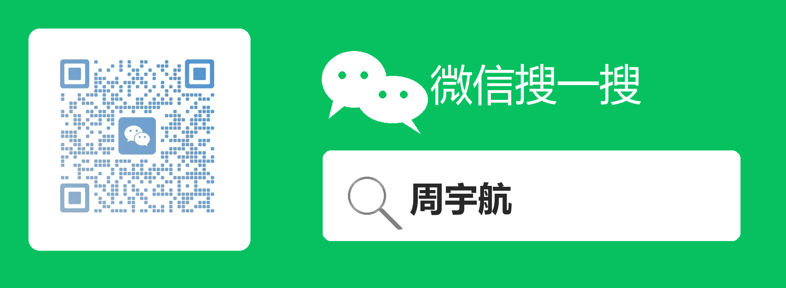

# Gewu · 格物

**Convierte "preguntarle a la IA cuando tengo una duda" en un mapa de aprendizaje con brújula.**

> Estudia una cosa a fondo para alcanzar el verdadero conocimiento: si puedes explicarla con claridad, de verdad la entiendes.


[](./LICENSE)
[](https://github.com/YuhangZho/gewu-skill/stargazers)
[](https://github.com/YuhangZho/gewu-skill/commits)


[](https://skills.sh/YuhangZho/gewu-skill)


[Para quién es](#para-quién-es) · [Qué obtendrás](#qué-obtendrás) · [Cómo empezar](#cómo-empezar) · [Instalación](#instalación) · [Estructura de directorios](#estructura-de-directorios)

**Otros idiomas:** [简体中文](README.md) · [English](README_EN.md)

---

## Para quién es

Gewu encaja en estos escenarios de aprendizaje:

- **Quieres entrar sistemáticamente en un campo nuevo**, pero no sabes qué estudiar primero ni después.
- **Tienes un objetivo claro**, como un examen, cambio de rol, incorporarte a un proyecto o iniciarte en un negocio, y necesitas saber qué te falta.
- **"Aprendizaje" fragmentado** — aprovecha el tiempo de espera de las respuestas de la IA para aprender cositas interesantes en trocitos.
- **Entiendes al preguntar a la IA, pero lo olvidas a los días**, sin llegar a dominarlo de verdad.

Gewu actúa como un presentador de aprendizaje: te acompaña a fijar un objetivo, diseña un mapa de conocimiento y una ruta de aprendizaje en torno a ese objetivo, te guía paso a paso para explicar los conceptos con claridad y, finalmente, asienta tus resultados de aprendizaje en local.

---

## Qué obtendrás

### Una ruta de aprendizaje que puedes recorrer

Solo di "quiero aprender IA / C / operaciones en Amazon / CET-4", y Gewu primero te preguntará por qué, y luego desglosará una ruta según tu objetivo. No es un índice de enciclopedia, sino "qué estudiar ahora, por qué estudiarlo primero, qué estudiar después".

### Un conjunto de notas realmente digeridas

Cada concepto no guarda solo la explicación de la IA, sino el resultado de lo que aprendiste:

- Un posicionamiento en una frase
- Aprendizajes clave
- Puntos de bloqueo y correcciones
- Límites, errores comunes
- Diagramas de flujo y referencias visuales cuando hace falta

### Una estación de conocimiento local

Lo que has aprendido se convierte en páginas locales abribles:

- **Hoja de ruta de aprendizaje**: ve dónde estás ahora y cuál es la siguiente parada.
- **Grafo de conocimiento**: ve cómo se conectan los conceptos.
- **Planificación de objetivos**: ve a qué distancia está tu conocimiento actual del objetivo.
- **Documentos de conceptos**: cada concepto que has aprendido se puede repasar.


### Puedes retomar donde lo dejaste, incluso a medias

Gewu registra el estado del aprendizaje. Si un concepto no se terminó, la próxima vez puedes continuar desde donde te atascaste, sin volver a explicar el contexto.

### El conocimiento disperso no se pierde

Si hoy solo quieres entender un concepto pequeño, también puedes registrarlo. Cuando se acumule contenido similar, Gewu lo organizará en el campo correspondiente, haciéndolo crecer en rutas y grafos.

---

## Cómo empezar

Dile una frase a tu IA:

```text
Aprende IA con Gewu
```

También puedes decir:

```text
Soy nuevo en C, ayúdame a planificar una ruta de aprendizaje.
```

```text
Ayúdame a entender el campo de las operaciones en Amazon.
```

```text
Guíame para aprender cómo mantener contenta a mi esposa y conseguir más dinero de bolsillo sin problemas.
```

En el primer uso, Gewu te preguntará dónde se guarda tu base de conocimiento. Elige una ubicación a largo plazo, por ejemplo:

```text
D:\gewu-vault
```

Después, la misma base de conocimiento seguirá acumulándose — no hace falta configurarla cada vez (la ruta se puede ajustar manualmente en ~/.gewu/glb_vault_path.json).

---

## Cómo aprende

Las acciones centrales de Gewu son simples:

1. **Pregunta el objetivo primero**: estudiarlo para un examen, entrevista, cambio de rol, incorporación a un proyecto o puro interés.
2. **Trazar la ruta**: ordena la secuencia de aprendizaje según dependencias previas e importancia.
3. **Aprender concepto por concepto**: plantea preguntas, explica, te pide que lo reformules, indaga en los puntos de bloqueo.
4. **Validar para cerrar**: solo cuando puedes explicarlo con otras palabras y sabes cuándo falla, se da por aprendido.
5. **Asentar de inmediato**: actualiza notas, hoja de ruta, grafo de conocimiento y progreso del objetivo.

Credo central: **La salida empuja a la entrada. Si puedes explicarlo con claridad, de verdad lo entiendes.**

---

## Instalación

Gewu sigue el estándar abierto de Agent Skills y puede usarse en agentes que soporten skills.

### Comprobación del entorno

```bash
python --version
```

- Muestra `Python 3.x`: el entorno está listo, puedes continuar instalando el skill.
- Comando no encontrado: instala Python primero. (PD: puedes usarlo sin Python, pero la base de conocimiento no se podrá persistir.)
  - Windows: [python.org/downloads](https://www.python.org/downloads/), marca `Add Python to PATH` durante la instalación
  - macOS: `brew install python`
  - Linux: `sudo apt install python3`

### Opción 1: Instalación con un clic

Dile al agente que estés usando:

```text
Ayúdame a instalar este skill: https://github.com/YuhangZho/gewu-skill
```

O ejecuta por línea de comandos:

```bash
npx skills add YuhangZho/gewu-skill
```

### Opción 2: Instalación manual

Copia la carpeta `gewu-skill` a la ruta correspondiente del agente.

<details>
<summary>Desplegar: directorios de skills para agentes comunes</summary>

| Agente | directorio de skills |
|---|---|
| Claude Code | `~/.claude/skills/` |
| Claude Escritorio / Cowork | Ajustes → Capabilities, añade la carpeta `gewu` |
| Codex | `~/.codex/skills/` |
| Cursor | `~/.cursor/skills/` |
| Kimi Work | `~/AppData/Roaming/kimi-desktop/daimon-share/daimon/skills/` |
| Marvis | `~/AppData/Roaming/Tencent/Marvis/User/xx/skills/custom/` |
| Trae CN | `~/.trae-cn/skills/` |
| Qoder CN | `~/.qoder-cn/skills/` |
| OpenClaw | `~/.openclaw/skills/` |
| Otros 50+ agentes | Las rutas varían, ver [tabla de soporte vercel-labs/skills](https://github.com/vercel-labs/skills#supported-agents) |

</details>

---

## Personalizar la apariencia

La estación de conocimiento usa por defecto el tema claro, y también soporta los temas oscuro, papel xuan y tinta nocturna. Copia la plantilla a tu base de conocimiento:

```text
tu-base-de-conocimiento/_system/config.json
```

Plantilla en:

```text
templates/config.example.json
```

Tras editar, regenera la estación de conocimiento para que surta efecto.

---

## Estructura de directorios

```text
gewu-skill/
  SKILL.md                      Archivo principal del skill
  templates/concept-template.md Plantilla de nota de concepto
  scripts/render_viz.py         Genera diagramas de estructura de conceptos
  scripts/build_graph.py        Genera el grafo de conocimiento
  scripts/plan_path.py          Genera la estación de conocimiento
  scripts/set_goal.py           Escribe objetivos y refresca las páginas
  assets/merged_output.mp4      Vídeo de demostración
```

Tras ejecutar, tu base de conocimiento se ve más o menos así:

```text
gewu-vault/
  AI/
    Token.md
    Context.md
    AI-hoja-de-ruta.html
    AI-grafo-de-conocimiento.html
    _viz/
      Token.model.json
      Token.mmd
      Token.svg
    _transcript/
      Token.jsonl
  fragment/
    conceptos-pequeños-aprendidos-al-vuelo.md
  _system/
    graph_data.json
    roadmap_data.json
    goals.json
    config.json
```

---

## Apto y no apto

Apto para:

- Aprender sistemáticamente un campo
- Asentar conversaciones con la IA en conocimiento repasable
- Cubrir lagunas de conocimiento en torno a un objetivo
- Usar el método Feynman para comprobar si de verdad entiendes

No apto para:

- Sustituir a bancos de preguntas, Anki o hacer miles de ejercicios
- Sustituir la práctica con proyectos reales
- Preguntar por el tiempo, etc.

---

## Agradecimientos

El borrador de la animación promocional se diseñó y produjo usando el paquete de skills [huashu-design](https://github.com/alchaincyf/huashu-design).

## Autor

Yuhang, un programador de sistemas embebidos destilándose 🧪 a sí mismo.

* El efecto de fusión de conocimiento disperso aún necesita más pruebas;

* Aunque se soportan Marvis, Trae y Qoder, las pruebas reales muestran resultados mediocres — los modelos pueden sufrir deriva de atención (2026.6.26).

* Cursor (auto) / Codex (5.5) / Claude (opus 4.8) / Kimi (K2.6) resultados de generación verificados como correctos.

<p align="left">
  
</p>

## Licencia

**MIT** © 2026 Yuhang ([@YuhangZho](https://github.com/YuhangZho)). Libre de usar y modificar, solo conserva el aviso de copyright y licencia.
